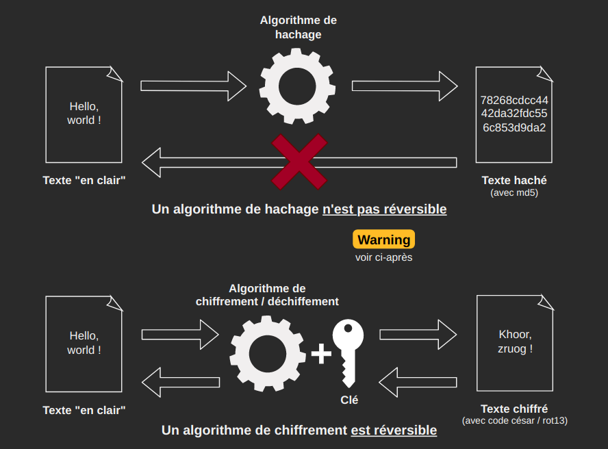
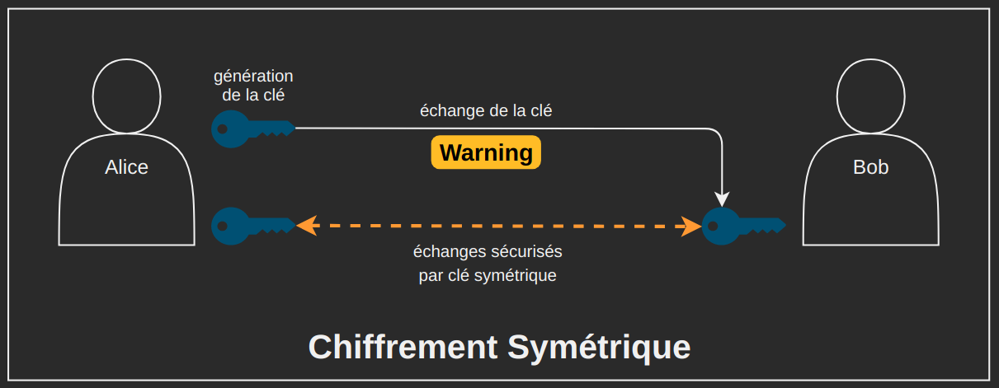
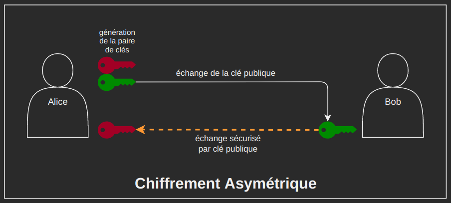
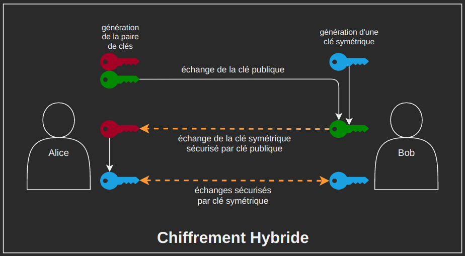

# A02 - Défaillances cryptographiques

[Lien Top10](https://owasp.org/Top10/fr/A02_2021-Cryptographic_Failures/)

Toujours dans le but de respecter le **principe de confidentialité**, nous devons nous assurer que les données transitant avec notre application et stockées dans sa base de données ne puissent pas être divulguées.

**Les échanges entre clients et serveurs doivent être chiffrés.**

Certaines données sensibles (exemple : les mots de passe des utilisateurs) doivent être stockées en base de données. Au cas où cette base de données serait compromise, **ces données sensibles doivent être hachées.**

## Cryptographie

Et si nous prenions le temps de voir la **différence entre chiffrement et hachage** ? Nous allons aussi découvrir **les différents "systèmes" de chiffrements**.

### Chiffrement vs. Hachage

Une fonction de hachage est conçue pour être **mathématiquement irréversible**. Aucun clé n'est nécessaire pour hacher.

Un algorithme de chiffrement quant à lui est justement conçu pour être réversible. On utilise une ou plusieurs clés pour chiffrer/déchiffrer.

### Fonctions de hachage

**Un même fichier / une même chaîne de caractère** passé dans une fonction de hachage **aura toujours le même hash, la même “empreinte”.**

Les fonctions de hachage sont utilisés par exemple pour **stocker des mots de passe en BDD**. N’étant **pas réversibles**, elles garantissent (si la fonction de hachage choisie est suffisamment “solide”) que même si la BDD est compromise, les mots de passe des utilisateurs ne seront pas récupérables.

:warning: Attention, certaines fonctions de hachage comme MD5 ou SHA-1 ne sont pas assez solides, et sont réversibles grâce à l’utilisation de [Rainbow Tables](https://fr.wikipedia.org/wiki/Rainbow_table). **Ces fonctions ne doivent pas être utilisées pour hacher des mots de passe !**

Pour permettre la connexion d’un utilisateur, on va **comparer le hash du mot de passe saisi avec le hash du mot de passe stocké.**

Les fonctions de hachage servent aussi à **contrôler l’intégrité d’un fichier !**

### :memo: Démo

- Démo : contrôle de l'intégrité du setup de VLC Media Player via son empreinte SHA256.
- Démo de hachage d’un mot de passe avec SHA256.

*Logiciel utilisé : sha256sum*

### Chiffrement

Le chiffrement est un **procédé cryptographique** permettant de **rendre inintelligible un document/message en utilisant une clé**. Pour pouvoir lire le contenu de ce document/message, il faudra au préalable le **déchiffrer avec une clé**.

Il existe **plusieurs “systèmes” de chiffrement** :

- **symétrique** : la même clé est utilisée pour chiffrer et déchiffrer le message
- **asymétrique** : des clés différentes sont utilisées pour chiffrer et déchiffrer le message : une clé publique permet de chiffrer, une clé privée de déchiffrer.
- **hybride** : une combinaison de chiffrement symétrique & asymétrique.

### Chiffrement symétrique

Le chiffrement symétrique consiste à utiliser **la même clé pour chiffrer et déchiffrer** un message. Ce procédé cryptographique est **simple à utiliser/implémenter**, et est **très rapide**.

Il a par contre **une faiblesse : l’échange de clé** (si la clé est interceptée, les messages chiffrés avec celle-ci pourront être déchiffrés).

### Chiffrement asymétrique

Le chiffrement asymétrique est **beaucoup plus complexe : deux paires de clés** (4 clés, donc) sont utilisées pour chiffrer et déchiffrer les messages.

**La clé publique peut-être échangée sans danger** : elle ne servira qu’à chiffrer les messages. **Pour les déchiffrer il faudra être en possession de la clé privée** correspondante. **Ce procédé est beaucoup plus lent.**

### Chiffrement hybride

Le chiffrement hybride est une **combinaison des deux procédés précédents**.

On va utiliser le **chiffrement asymétrique pour sécuriser l’échange d’une clé symétrique** qui sera ensuite utilisée pour chiffrer les échanges rapidement.

## Recherche de faille & exploitation

### Fonction de hachage faible

Dans notre application, à l'heure actuelle, les mots de passe sont chiffrés avec MD5, un algorithme qui n'est pas assez solide et est maintenant réversible. Si quelqu'un de mal-intentionné arrive à accéder à la base de données, il pourra retrouver les mots de passe utilisés à partir de leur hash.

:pirate_flag: **démo** :pirate_flag:

*Logiciels utilisés : md5sum, hashcat*

### Échanges non chiffrés

Les échanges entre les clients et le serveur peuvent potentiellement être interceptés (WiFi public, réseau d’entreprise compromis, etc.). Si ces échanges ne sont pas chiffrés, toutes les données transitent en clair (y compris les mots de passe) !

Or actuellement, notre application est uniquement accessible via HTTP, et pas via HTTPS.

:pirate_flag: **démo** :pirate_flag:

*Logiciels utilisés : wireshark*

## Remédiation

Tout d’abord, concernant la sécurité des mots de passe :

- Les mots de passe **doivent être hachés avec une fonction de hachage solide** (SHA256/512, bcrypt, argon, etc.)
- Pour se protéger au mieux des attaques, **les hash générés peuvent être salés** : on ajoute une donnée supplémentaire au mot de passe avant le hachage. Le sel utilisé devra également être stocké en BDD.

Ce soir en challenge, vous devrez mettre à jour notre application, d’abord avec hash+salt manuel et ensuite avec la fonction PHP `password_hash()` !

Les échanges entre les clients et le serveur **doivent être chiffrés**, pour éviter que les données transitent en clair … et soient potentiellement interceptés ou altérées.

- Une seule solution : mettre en place un certificat et forcer l’utilisation de HTTPS sur notre application.

:computer: **Pratique : mise en place d’un certificat HTTPS avec letsencrypt & certbot.** :computer:

## Navigation

:house: [Retour à l'accueil](README-index.md)

:previous_track_button: [Précédent : A01](README-A01.md)

:next_track_button: [Suivant : A03](README-A03.md)
